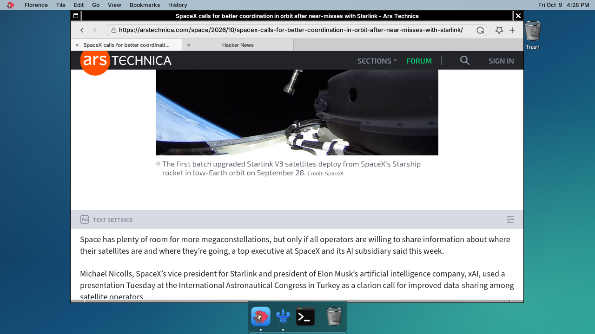

<p align="center"></p>

# Florence

**A small web browser for small machines.** Florence is a browser for the Raspberry Pi 3 (1 GB of RAM, a Cortex-A53) running the Darwin/XNU port in the sibling repository [iokit](https://github.com/anurodhp/xnu-iokit-pi3). The engine is real [WPE WebKit](https://wpewebkit.org) 2.54.0; the window, tabs and menus are a native GNUstep application.

The screenshot is the Pi's own screen: Florence on [Ars Technica](https://arstechnica.com) with a second tab open, the [Naples](https://github.com/anurodhp/naples) dock and menu bar, and [Milan](https://github.com/anurodhp/milan) drawing the desktop.

## How it works

WebKit's WPE port has no toolkit of its own. It lets the embedder supply a display and then hands over each finished frame as a pixel buffer. Florence supplies that display (`frontend/flo_platform.c`), takes the frames and draws the exposed rectangle into a GNUstep view. Input goes the other way as plain numbers.

- **Rendering:** GPU by default. WebKit's GL compositor and Skia's GL backend run on the Pi's VideoCore IV (`GL_RENDERER: VC4 V3D 2.1`) through libepoxy, an EGL layer written for this project (`compat/egl`) and Mesa's libGL. Frames are read back into shared memory. `FLORENCE_CPU=1` selects the older CPU path, which needs no GL stack.
- **JavaScript:** JavaScriptCore with the LLInt interpreter plus the baseline and DFG JIT (no FTL, no WebAssembly). `JSC_useJIT=false` turns the JIT off at run time.
- **One loop:** GLib's main context is driven from GNUstep's run loop (`FloGLib.m`), with no extra thread and no polling timer.
- **Lean build:** 103 WebKit build options are turned off or on deliberately (`config/webkit-options.cmake`, each checked against the pinned tree by `scripts/check_webkit_options.sh`). Every edit to WebKit itself, and why, is in `docs/webkit-patches.md`.

## What you can do

- Browse the web over HTTP and HTTPS (OpenSSL 3 and glib-networking; the padlock shows only for a loaded page whose certificate was checked).
- Tabs, one engine page per tab; links that open a new tab; a start page of bookmark and recently-visited tiles.
- Address bar that searches the web for anything that is not an address; back, forward, reload.
- Bookmarks, history, find in page, zoom, and a Preferences window (homepage, search engine, downloads folder, font size, JavaScript on or off, cache, history).
- Ad blocking with Safari-format content-blocker rule lists, which WebKit reads natively. The compiled rules are cached between runs.
- Downloads, a context menu and Cmd-click, and copy and paste with the rest of the desktop.
- Mouse wheel and keyboard scrolling.
- Runs on Linux as well, for development (see below).

## What you cannot do (yet)

- No video or audio (`<video>`, `<audio>`, WebAudio, WebRTC and DRM are not built), no WebGL, WebGPU or WebAssembly.
- No PDF viewer, printing, spell checking, geolocation, notifications, extensions or developer tools.
- No pop-up windows (they are refused), and no favicons in the tab strip (the WPE API in this build has no getter).
- No overlay scroll bars in the GL renderer. The CPU renderer draws them.
- Key events carry no hardware keycode, so `KeyboardEvent.code` is empty.
- It is not fast. Scrolling a heavy page such as reddit.com ran at about 12 frames per second in the last measurement; see below.
- Building it needs a Mac and the whole iokit toolchain. There is no prebuilt package.

## What has been tested

On a real Raspberry Pi 3, running the Darwin port:

| | Result |
|---|---|
| Browsing real sites | arstechnica.com, news.ycombinator.com and reddit.com load and render (the screenshot above); https://example.com loads over TLS |
| Engine smoke test (`tests/smoke_engine.c`) | frame arrives, title and address events, pixel check, click navigation and wheel scroll: 8 of 8 |
| Support libraries, each with a test program under `tests/pi/` | libc++ (`cxx_smoke`, 15 of 15), ICU 74 (`icu_smoke`, 8 of 8), GLib (`glib_smoke`, 13 of 13), TLS (`tls_smoke`), EGL (`egl_smoke`) |
| JIT | `jit_probe` passes (executable memory and the RW-to-RX switch). `tests/pages/bench.html`: fib 129 to 23 ms, sort 422 to 158 ms, about 5 MB more web-process memory |
| GL frame readback | 4.4 to 12.6 frames per second on reddit.com (`tests/pi/gl_readback_bench.c`) |
| C library speed and integrity | `mem_bench`, `malloc_bench`, `str_test`, `fault_bench` |

On Linux (Ubuntu 24.04, x86-64): the whole engine builds and `scripts/test_host.sh` passes its checks headless.

Not tested or not measured: memory use of a normal browsing session on the Pi, idle CPU, battery or thermals, long sessions, and any site beyond the ones above. The UI has been used by hand rather than by an automated test.

## Building

You need:

- a Mac with **Xcode 12** (the iPhoneOS 14.4 SDK) and a current Xcode for its linker, and the [iokit](https://github.com/anurodhp/xnu-iokit-pi3) repository checked out next to this one (`../iokit`, or set `IOKIT_DIR`) with its own `setup_third_party.sh` run. `CLAUDE.md` explains the toolchain and why it is set up that way;
- about 2 GB of disk for the pinned WebKit and its sparse clone, and an hour or more for the engine.

```sh
./setup_third_party.sh               # pin and fetch WebKit (sparse, 1.8 GB) and the dependency sources
scripts/build_compat.sh              # libflocompat: the libSystem and libm gaps
scripts/build_libcxx.sh              # LLVM libc++ beside the system one
scripts/build_icu.sh                 # ICU 74
scripts/build_glib.sh                # GLib, then the other dependencies:
                                     #   build_pcre2, build_cmake_lib (libxml2, nghttp2, libwebp, libjpeg-turbo),
                                     #   build_brotli, build_woff2, build_sqlite, build_harfbuzz, build_openssl,
                                     #   build_autotools_lib (libgcrypt, libtasn1), build_meson_lib (libepoxy, libxkbcommon,
                                     #   libpsl, libsoup, glib-networking), build_egl
scripts/build_webkit.sh cross        # WPE WebKit 2.54.0
scripts/build_florence.sh pi         # Florence.app, into build/root/Applications
scripts/deploy_pi_webkit.sh          # copy everything to the Pi (PI_HOST, default 10.0.0.142)
```

`scripts/deploy_pi_webkit.sh stage` leaves the tree in `build/deploy` instead, and the iokit repository's `tools/init_binary/inject_into_sd_image.sh` copies it into the SD card image. `docs/HANDOFF.md` has the order the libraries were built in and the lessons each one cost.

To develop the engine glue and the UI on Linux, install WPE's build dependencies and gnustep-base and gnustep-gui (the package list is at the top of `scripts/build_webkit.sh`), then:

```sh
scripts/build_webkit.sh host         # the engine, built with the host compiler
scripts/build_florence.sh host       # build/florence-host/florence; run it under an X server
scripts/test_host.sh                 # engine end to end, no UI, no X
```

## Running and tuning

On the Pi, Florence is `/Applications/Florence.app`. Settings are environment variables:

| Variable | What |
|---|---|
| `FLORENCE_CPU=1` | CPU renderer instead of GL |
| `FLORENCE_STATS=1` | print frames per second |
| `FLORENCE_AUTOSCROLL` | scripted wheel scroll, for measuring |
| `FLORENCE_NO_IMAGES=1` | do not load images |
| `FLORENCE_SKIA_READBACK=1` | Skia's frame readback instead of the direct one |
| `JSC_useJIT=false` | JavaScript without the JIT |

## Layout

| | |
|---|---|
| `frontend/flo.h` | the one interface between the UI and the engine glue: plain C types |
| `frontend/flo_engine.c`, `flo_platform.c` | the WebKit web view and settings, and the WPE display that receives frames |
| `frontend/FloGLib.m` | GLib's main context driven from NSRunLoop |
| `frontend/FloBrowser.m`, `FloToolbar.m`, `FloTab.m`, `FloPageView.m` | window, toolbar, tabs, and the view that draws frames and sends input |
| `frontend/FloStore.m`, `FloPrefs.m`, `FloStartPage.m`, `FloAbout.m` | bookmarks and history, preferences, start page, About |
| `compat/` | libSystem and libm gaps (`libflocompat`) and the EGL layer |
| `config/webkit-options.cmake` | the WebKit build options and the reason for each |
| `scripts/` | one build script per library and for WebKit and Florence |
| `tests/` | the engine smoke test and the on-device tests |
| `docs/` | `webkit-port.md` (design), `webkit-patches.md` (every WebKit edit), `jit-plan.md`, `HANDOFF.md` (lab notebook) |

The previous engine and its UI are at the tag `legacy-engine`.

## License

The original code in this repository is MIT, see `LICENSE` and `LICENSES/MIT.txt`. Third-party code keeps its own licence: WebKit is LGPL-2 and BSD (linked as shared libraries, fetched by `setup_third_party.sh`), and the few vendored or derived files are listed under "Exceptions" in `LICENSE`.
